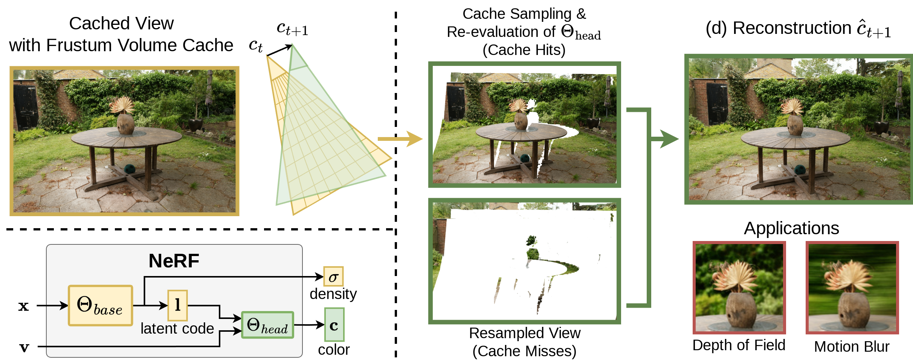

# Frustum Volume Caching for Accelerated NeRF Rendering

This is the CUDA/C++ source code for the HPG 2024 submission "Frustum Volume Caching for Accelerated NeRF Rendering".

This project contains the real-time viewer and offline-renderer implementation of our proposed caching and reprojection approach.



# Dependencies and Pre-Requisites

The source code was tested on an Ubuntu 22.04 system with CUDA 12.2, and requires an NVIDIA GPU (RTX 4090 and RTX 3080Ti) with Tensor-Cores and CUDA > 12.

We include the following submodules:

* [glfw](https://github.com/glfw/glfw.git)
* [tiny-cuda-nn](https://github.com/NVlabs/tiny-cuda-nn)
* [zstr](https://github.com/Tom94/zstr)
* [imgui](https://github.com/ocornut/imgui.git)
* [glm](https://github.com/g-truc/glm)
* [owl](https://github.com/owl-project/owl.git)

To clone the repository and initialize all submodules, execute the folowing:

```
git clone --recursive https://github.com/steimich96/FrustumVolumeCaching.git
cd FrustumVolumeCaching
```

On Debian based Linux, you will need to install the following packages to run the real-time viewer:

```
sudo apt-get install libglfw3-dev
```

# Building

Compilation requires CMake (version 3.21), and a C++17 capable compiler.

You can build with the following commands:

```
cmake . -B build -DCMAKE_BUILD_TYPE=RelWithDebInfo
cmake --build build -j 8
```

Building the first time can take serveral minutes, mostly due to `tiny-cuda-nn`.

(Optional) We use [OWL](https://github.com/owl-project/owl) ("OptiX Wrapper Library") to accelerate rendering by ray-tracing against the meshed occupancy grid.
This optional feature is enabled by providing `-DRTX_ENABLED=ON` during cmake configuration, and requires [NVIDIA Optix 7.7](https://developer.nvidia.com/designworks/optix/downloads/legacy) and setting the `OptiX_INSTALL_DIR` environment variable.

# Running the Code

<!-- We include a trained model of the Garden scene from the [MipNerf-360](https://jonbarron.info/mipnerf360/) dataset. The model is located in `examples/garden_ours` and uses the model configuration referred to as `Ours` in the paper. -->

We provide two separate executables, for the real-time viewer and the evaluation testbench.
The available command line arguments for both can be checked by running them with `--help` (or `-h`).

## Real-time Viewer

To run the real-time viewer in 720p resolution, execute

```
./build/realtime_viewer/realtime-viewer <path_to_model> -r 1280 720
```

## Evaluation Testbench

The evaluation of quality and performance where performed on the `eval` build target.
The following commands illustrate how to write the cache images and time the performance for all test images (and all rotation/translation cache movements):

```
./build/eval <path_to_model> <test_transforms_json_file> <output_path> -w -wi -wc
```

The following commands were used for the performance timings, rendering the same images as the above command (without writing them to files), and averaging the performance over 10 iterations in Full HD (1920x1080):

```
./build/eval <path_to_model> <test_transforms_json_file> <output_path> -nrit 10 -or -r 1920 1080
```


# Troubleshooting

When running into out-of-memory exceptions, try reducing resolution or disable double-buffering with the `-s` flag.
The source code currently does not reuse GPU buffers very efficiently, leading to large memory requirements outside of cache size.

# Cache Settings

The maximum size of the cache data arrays is fixed at compile-time. 

The same is true for the size of the latent codes that can be stored in cache.
Rendering from cache still works if the used model has smaller latent code size than what the cache provides, however, not the other way around.
For optimal performance, choose the cache latent code size equal to the actual model's latent code size.

You can change the following default settings in `cache.h`:

```cpp
// These two values influence maximum cache data array size
// This allows us to change the brick size without having to change the estimates
int INIT_ESTIMATED_N_SAMPLES_PER_RAY = 32;  // Estimate of the number of expected samples per ray
float INIT_ESTIMATED_BRICK_SPARSITY = 0.5f; // Estimate of how sparsly populated the bricks will be

int BRICK_SIZE = 8;     // Other valid choices for these are (6,1), (14,1), (16,0)
int BRICK_PADDING = 0;

int N_DATA_ARRAYS = 2; // For optimal performance, "N_DATA_ARRAYS*4" should be chosen equal to the model's latent code size (latents are stored in half4 3D textures).
```